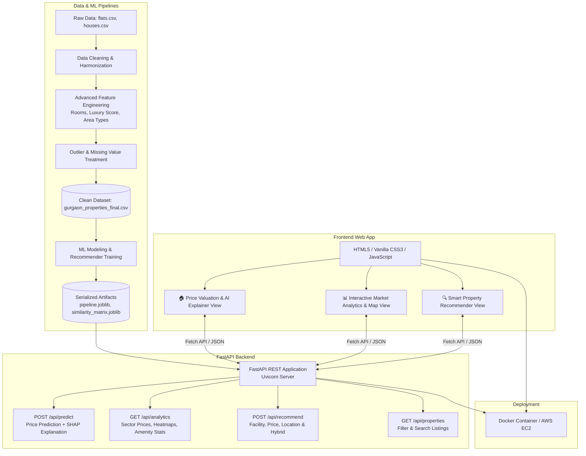

# Capstone Project Master Implementation Plan: Real Estate Data Science Application

## 🎯 Architecture: FastAPI Backend + Modern HTML/CSS/JS Frontend

This plan outlines the complete, end-to-end architecture, development roadmap, and execution strategy for building the **Real Estate Data Science Application (Gurgaon Housing Market)** featuring a high-performance **FastAPI REST backend** and a modern, responsive **HTML5/CSS3/JavaScript frontend**.

---

## 🏗️ System Architecture Flow



---

## 📂 Target Project Directory Structure

```text
Housing/
├── configs/
│   ├── config.yaml                    # Global configs & hyperparameters
│   └── sector_mapping.json            # Sector aliases & normalization mappings
├── data/
│   ├── raw/                           # flats.csv, houses.csv
│   ├── interim/                       # flats_cleaned.csv, house_cleaned.csv, gurgaon_properties.csv
│   └── processed/                     # gurgaon_properties_cleaned_v1.csv, gurgaon_properties_final.csv
├── notebooks/                         # Ordered exploration notebooks
│   ├── 01_data_cleaning.ipynb
│   ├── 02_feature_engineering.ipynb
│   ├── 03_eda_analysis.ipynb
│   ├── 04_outliers_and_missing_values.ipynb
│   ├── 05_feature_selection.ipynb
│   ├── 06_model_selection_and_tuning.ipynb
│   └── 07_recommender_system.ipynb
├── src/                               # Core Python ML & Data Pipeline
│   ├── __init__.py
│   ├── data/                          # Data cleaning & merging pipeline
│   │   ├── clean_flats.py
│   │   ├── clean_houses.py
│   │   ├── merger.py
│   │   └── data_pipeline.py
│   ├── features/                      # Feature engineering & transformers
│   │   ├── sector_normalizer.py
│   │   ├── room_extractor.py
│   │   ├── luxury_score_calculator.py
│   │   └── area_parser.py
│   ├── models/                        # ML Training & Inference
│   │   ├── train.py
│   │   ├── evaluate.py
│   │   └── predict.py
│   └── recommender/                   # 3-Tier Recommendation Engine
│       ├── facility_recommender.py
│       ├── price_config_recommender.py
│       ├── location_recommender.py
│       └── hybrid_recommender.py
├── artifacts/                         # Saved ML models, encoders, similarity matrices
│   ├── price_pipeline.joblib
│   ├── feature_metadata.json
│   ├── facility_similarity.joblib
│   ├── location_similarity.joblib
│   └── hybrid_recommender.joblib
├── backend/                           # FastAPI Application
│   ├── __init__.py
│   ├── main.py                        # FastAPI entry point & CORS configuration
│   ├── routes/
│   │   ├── predict.py                 # Valuation endpoint
│   │   ├── analytics.py               # Aggregations, charts & geo data
│   │   ├── recommend.py               # Recommender endpoint
│   │   └── properties.py              # Property catalog & filters
│   ├── schemas/                       # Pydantic request/response validation
│   │   ├── prediction_schema.py
│   │   └── recommendation_schema.py
│   └── services/                      # Model loader & inference services
│       ├── ml_service.py
│       └── recommender_service.py
├── frontend/                          # HTML5 / CSS3 / JavaScript Web App
│   ├── index.html                     # Main Single-Page / Tabbed UI
│   ├── css/
│   │   ├── style.css                  # Custom design system (dark/light, glassmorphism)
│   │   └── components.css             # Cards, sliders, modals, tooltips
│   ├── js/
│   │   ├── api.js                     # API client for backend communication
│   │   ├── predictor.js               # Valuation form handling & animations
│   │   ├── analytics.js               # Chart.js & Leaflet map visualizations
│   │   ├── recommender.js             # Recommendation cards & filters
│   │   └── main.js                    # Navigation & UI interactions
│   └── assets/                        # Icons, logo, background graphics
├── Dockerfile                         # Unified multi-stage container
├── requirements.txt                   # FastAPI, Uvicorn, Scikit-learn, XGBoost, etc.
└── README.md
```

---

## 🗓️ Phased Implementation Plan

### Phase 1: Robust Data Pipeline & Automation
- [ ] Fix row index mutations in Level-1/Level-2 cleaning by using deterministic logic and `random_state=42`.
- [ ] Implement `configs/sector_mapping.json` for centralized sector normalization.
- [ ] Refactor notebook logic into modular Python scripts (`src/data/`).
- [ ] Generate clean intermediate dataset: `data/processed/gurgaon_properties_cleaned_v1.csv`.

---

### Phase 2: Advanced Feature Engineering
- [ ] **Area Decomposition**: Parse `areaWithType` into `super_built_up_area`, `built_up_area`, `carpet_area`.
- [ ] **Additional Rooms**: Multi-hot encode `has_study_room`, `has_servant_room`, `has_pooja_room`, `has_store_room`.
- [ ] **Furnishing Status**: Categorize into `Unfurnished`, `Semi-Furnished`, `Fully-Furnished` and count appliances (`num_ac`, etc.).
- [ ] **Luxury Score Calculator**: Parse `features` amenity arrays into a standardized `luxury_score` (0–100).
- [ ] **Age of Possession**: Standardize into ordinal bins (`Under Construction`, `0-1 Year`, `1-5 Years`, `5-10 Years`, `10+ Years`).
- [ ] **Nearby Locations**: Compute proximity counts for metro stations, schools, hospitals, and shopping centers.
- [ ] Output: `data/processed/gurgaon_properties_features.csv`.

---

### Phase 3: Outlier Handling & Missing Value Imputation
- [ ] Detect and treat price/sqft anomalies and unreal bedroom/area ratios.
- [ ] Impute missing numerical fields (IterativeImputer/KNN) and categorical modes.
- [ ] Output: `data/processed/gurgaon_properties_final.csv`.

---

### Phase 4: Model Training, Selection & Pipeline Serialization
- [ ] Benchmark models: Linear Regression, Ridge, LASSO, SVR, Decision Trees, Random Forest, ExtraTrees, Gradient Boosting, XGBoost, LightGBM, CatBoost.
- [ ] Apply $\log(1 + \text{price})$ transformation for variance stabilization.
- [ ] Hyperparameter tuning using `GridSearchCV` / `Optuna`.
- [ ] Bundle preprocessor + best model into `artifacts/price_pipeline.joblib`.

---

### Phase 5: 3-Tier Recommender System Engine
- [ ] **Facility/Amenities Model**: Cosine similarity on amenity & luxury score vectors.
- [ ] **Price & Config Model**: Normalized distance on price, BHK, area, floor, property type.
- [ ] **Location Advantage Model**: Similarity on spatial sector proximity & infrastructure counts.
- [ ] **Hybrid Model**: Weighted combination of all 3 engines.
- [ ] Export: `artifacts/hybrid_recommender.joblib`.

---

### Phase 6: FastAPI Backend Development
- [ ] **Setup FastAPI App & Middleware**: Configure CORS, gzip compression, and error handlers.
- [ ] **Pydantic Schemas**: Define strict typing for prediction inputs, recommendation parameters, and responses.
- [ ] **API Endpoints**:
  - `POST /api/predict`: Price prediction + SHAP feature impact breakdown.
  - `GET /api/analytics/overview`: High-level market stats (avg price, total listings, price per sqft).
  - `GET /api/analytics/sectors`: Sector-wise price rankings, distributions, and map coordinates.
  - `GET /api/analytics/amenities`: Top amenities frequency and luxury distribution.
  - `POST /api/recommend`: Property recommendations with match percentage and highlighted reasons.
  - `GET /api/properties`: Filterable property catalog with search & pagination.
  - `GET /api/sectors`: Autocomplete list of valid sectors.

---

### Phase 7: Modern HTML5/CSS3/JavaScript Frontend Development
- [ ] **Design System & Layout**:
  - Premium aesthetic: Glassmorphism cards, sleek dark/light mode, modern typography (Inter/Outfit), fluid responsive design.
  - Navigation bar with smooth transitions between tabs/pages:
    - 🏠 **Price Predictor**
    - 📊 **Market Analytics**
    - 🔍 **Property Recommender**
    - 🏢 **Property Explorer**
- [ ] **Module 1: 🏠 Price Predictor Interface**:
  - Interactive form with dynamic sliders and dropdowns (Sector, Property Type, BHK, Area, Floor, Age, Rooms, Luxury).
  - Live price estimation card with animated count-up numbers (in ₹ Crores & ₹ Lacs).
  - Price Range / Confidence interval bar.
  - Dynamic visual breakdown showing which features added the most value.
- [ ] **Module 2: 📊 Market Analytics Dashboard**:
  - Interactive map (Leaflet.js) showing Gurgaon sectors color-coded by average price/sqft.
  - Interactive charts (Chart.js / ApexCharts):
    - Price vs Area scatter plot with trendlines.
    - Sector price comparison bar & box plots.
    - Property type breakdown (Flats vs Houses).
    - Top amenities frequency chart.
- [ ] **Module 3: 🔍 Smart Property Recommender Interface**:
  - Filter by reference property or custom criteria (BHK, budget, sector).
  - Recommendation cards displaying Match Score (%), price, area, highlights (e.g., *"Top Facility Match: Swimming pool, Gym, Club house"*), and location advantages.
- [ ] **Module 4: 🏢 Property Explorer & Search**:
  - Searchable, filterable table/cards of listings with instant keyword search.

---

### Phase 8: Integration, Testing & Deployment
- [ ] **FastAPI + Frontend Integration**: Connect all fetch calls to the live FastAPI endpoints.
- [ ] **Automated Testing**: Unit tests (`pytest`) for backend endpoints and data transformations.
- [ ] **Dockerization**: Create a unified `Dockerfile` serving the FastAPI backend and static frontend via Uvicorn.
- [ ] **Deployment Guide**: Instructions for AWS EC2 / Render / Railway / Docker deployment.
